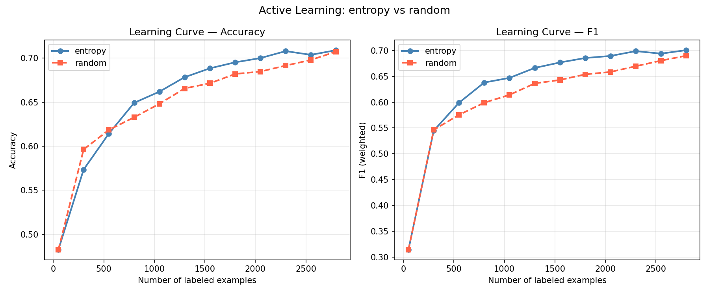

# ML Data Pipeline — Claude Code Skills

Набор агентов и скиллов для подготовки ML-датасетов: поиск → чистка → разметка → active learning.
Все этапы объединены в единый пайплайн, запускаемый одной командой.

---

## Демо-видео

Запись демонстрации полного пайплайна: [Google Drive](https://drive.google.com/drive/folders/1lw1AV9gAPa6Vb1bh69g7H-8kpW4edqnU?usp=sharing)

---

## Active Learning: влияние дисбаланса классов

В записи пайплайна был применён довольно грубый способ устранения дисбаланса —
undersampling до минорного класса (1,373 × 3 = 4,119 строк, потеря 72% данных).
После эксперимента выяснилось: **именно на несбалансированных данных AL работает
значительно эффективнее** — entropy sampling активно ищет редкие примеры (negative, 12%),
которые random пропускает.

### Несбалансированные данные (9,446 строк: positive 48% / neutral 39% / negative 12%)



| Меток | Entropy F1 | Random F1 | Δ F1 |
|-------|-----------|-----------|------|
| 50    | 0.314 | 0.314 | 0.000 |
| 300   | 0.545 | 0.546 | −0.002 |
| 550   | 0.599 | 0.575 | **+0.023** |
| 800   | 0.638 | 0.599 | **+0.039** |
| 1,300 | 0.666 | 0.636 | **+0.030** |
| 1,800 | 0.686 | 0.654 | **+0.032** |
| 2,300 | 0.699 | 0.670 | **+0.029** |
| 2,800 | 0.701 | 0.690 | **+0.011** |

**Экономия: 500 меток (17.9%)** — entropy достигает финального F1 random уже при 2,300 метках.

---

### Сбалансированные данные (4,119 строк: 1,373 × 3 классов)


| Меток | Entropy F1 | Random F1 | Δ F1 |
|-------|-----------|-----------|------|
| 50    | 0.4885 | 0.4885 | +0.000 |
| 250   | 0.2767 | 0.5713 | **−0.295** |
| 500   | 0.6706 | 0.6789 | −0.008 |
| 750   | 0.7281 | 0.6911 | **+0.037** |
| 1,000 | 0.7519 | 0.7209 | **+0.031** |
| 1,250 | 0.7732 | 0.7482 | **+0.025** |
| 1,500 | **0.7894** | 0.7523 | **+0.037** |

**Экономия: ~250 меток** — с 750 меток entropy стабильно опережает random на +0.025–0.037 F1.
Провал entropy при 250 метках — известный эффект cold start: граничные примеры сложны для модели без достаточного обучения.

---

### Вывод

В финансовом домене с дисбалансом классов AL (entropy sampling) **компенсирует нехватку
редких примеров**: при 800 метках разрыв +0.039 F1, который сохраняется до 2,800 меток.
На сбалансированных данных случайная выборка уже даёт хорошее покрытие — entropy
теряет преимущество и в первых итерациях даже проигрывает random.

> Данные получены экспериментально на реальных датасетах финансовых новостей
> (zeroshot, prithvi1029, Jean-Baptiste). Все запуски воспроизводимы: `random_state=42`.

---

## Быстрый старт

### 1. Установить зависимости

```bash
uv sync
```

### 2. Настроить API ключи

```bash
cp .env.example .env
# Открыть .env и заполнить ключи
```

```env
OPENROUTER_API_KEY=sk-or-...     # обязательно (LLM фильтрация датасетов)
OPENROUTER_MODEL=qwen/qwen3-30b-a3b
HF_TOKEN=hf_...                  # опционально (повышает rate limit HuggingFace)
KAGGLE_USERNAME=...              # для поиска по Kaggle
KAGGLE_KEY=...
```

### 3. Открыть в Claude Code

```bash
claude .
```

### 4. Запустить пайплайн

```bash
uv run run_pipeline.py
```

---

## Пайплайн

```
┌──────────────────┐    ┌──────────────────┐    ┌──────────────────┐    ┌──────────────────┐
│  1. Collector    │    │  2. Detective    │    │  3. Annotator    │    │  4. ActiveLearn  │
│  Сбор данных     │───▶│  Чистка данных   │───▶│  Авторазметка    │───▶│  Оптимизация     │
└──────────────────┘    └──────────────────┘    └──────────────────┘    └──────────────────┘
        │                       │                       │                       │
        ▼                       ▼                       ▼                       ▼
data/raw/unified.csv   data/cleaned/           data/labeled/           data/al/learning_curve.png
                       unified_clean.csv       labeled.csv
```

На каждом этапе — **human-in-the-loop**: агент останавливается, показывает что нашёл,
и ждёт подтверждения перед тем как двигаться дальше.

---

## Агенты

| Агент | Файл | Задание |
|-------|------|---------|
| DataCollectionAgent | `agents/data_collection_agent.py` | Задание 1 |
| DataQualityAgent | `agents/data_quality_agent.py` | Задание 2 |
| AnnotationAgent | `agents/annotation_agent.py` | Задание 3 |
| ActiveLearningAgent | `agents/al_agent.py` | Задание 4 |

### DataCollectionAgent (Задание 1)

Собирает данные из нескольких источников, приводит к unified schema.

```python
from agents.data_collection_agent import DataCollectionAgent

agent = DataCollectionAgent(config='config_annotation.yaml')
df = agent.run(sources=[
    {'type': 'hf_dataset', 'name': 'imdb'},
    {'type': 'scrape', 'url': 'https://...', 'selector': '.review-text'},
    {'type': 'api', 'endpoint': 'https://api.example.com/data', 'params': {}},
])
# → pd.DataFrame: text, audio, image, label, source, collected_at
```

**Unified schema:**

| Колонка | Описание |
|---------|----------|
| `text` | Текстовый контент |
| `audio` | Путь к аудиофайлу |
| `image` | Путь/URL к изображению |
| `label` | Метка класса |
| `source` | `hf:<name>`, `kaggle:<name>`, `scrape:<url>`, `api:<endpoint>` |
| `collected_at` | ISO timestamp |

### DataQualityAgent (Задание 2)

Детектирует и исправляет проблемы качества: пропуски, дубликаты, выбросы, дисбаланс классов.

```python
from agents.data_quality_agent import DataQualityAgent

agent = DataQualityAgent()
report = agent.detect_issues(df, label_col='label')
# → {'missing': {...}, 'duplicates': N, 'outliers': {...}, 'imbalance': {...}, 'severity': 'medium'}

df_clean = agent.fix(df, strategy={
    'missing': 'median',      # mean | median | mode | ffill | drop_rows | constant
    'duplicates': 'drop',     # drop | keep_last | keep_none
    'outliers': 'clip_iqr',   # clip_iqr | clip_zscore | drop
})

comparison = agent.compare(df, df_clean)
# → DataFrame: metric | before | after | change | change_pct
```

Для детальной аналитики — отдельные скрипты в `scripts/quality/`:

```bash
uv run scripts/quality/detect_missing.py --input data.csv --output missing.json
uv run scripts/quality/detect_outliers.py --input data.csv --method iqr
uv run scripts/quality/fix_duplicates.py --input data.csv --keep first --output clean.csv
uv run scripts/quality/compare.py --before data.csv --after clean.csv
```

### AnnotationAgent (Задание 3)

Автоматически размечает тексты через zero-shot классификацию (NLI). Флагует сомнительные примеры для ручной проверки. Экспортирует в LabelStudio.

```python
from agents.annotation_agent import AnnotationAgent

agent = AnnotationAgent(modality='text', confidence_threshold=0.75)
df_labeled = agent.auto_label(df, candidate_labels=['positive', 'negative', 'neutral'])
# Модель: cross-encoder/nli-MiniLM2-L6-H768 (~120MB, быстрая)

spec = agent.generate_spec(df, task='sentiment_classification')
# → annotation_spec.md: задача, классы, примеры, граничные случаи

metrics = agent.check_quality(df_labeled, reference_col='human_label')
# → {'kappa': 0.72, 'label_dist': {...}, 'confidence_mean': 0.85}

agent.export_to_labelstudio(df_labeled)
# → labelstudio_import.json + review_queue.csv (human-in-the-loop бонус)
```

```bash
uv run agents/annotation_agent.py \
    --input data/cleaned/unified_clean.csv \
    --labels "positive,negative,neutral" \
    --confidence-threshold 0.75 \
    --output-dir data/labeled
```

### ActiveLearningAgent (Задание 4)

Итеративно выбирает наиболее информативные примеры для разметки. Сравнивает стратегии entropy vs random. Показывает экономию меток.

```python
from agents.al_agent import ActiveLearningAgent

agent = ActiveLearningAgent(model='logreg')
history = agent.run_cycle(
    labeled_df=df_labeled_50,
    pool_df=df_unlabeled,
    strategy='entropy',   # entropy | margin | random
    n_iterations=5,
    batch_size=20,
    test_df=df_test,
)
agent.report(history, compare_history=random_history)
# → learning_curve.png: обе кривые на одном графике
```

```bash
uv run agents/al_agent.py \
    --input data/labeled.csv \
    --strategy entropy \
    --n-start 50 --n-iterations 5 --batch-size 20 \
    --compare --output-dir data
```

**Результат на финансовых новостях (3 класса, 4,119 строк, сбалансировано):**
- Entropy достигает F1=0.760 при **1,500 метках**
- Random достигает той же F1 при **1,750 метках**
- Экономия: **250 меток (16.7%)** — подробнее в `reports/al_report.md`

---

## Скиллы

| Скилл | Файл | Агент |
|-------|------|-------|
| Dataset Search | `skills/dataset_search.md` | DataCollectionAgent |
| Scrape | `skills/scrape.md` | DataCollectionAgent |
| Fetch API | `skills/fetch_api.md` | DataCollectionAgent |
| Detect Issues | `skills/detect_issues.md` | DataQualityAgent |
| Auto Label | `skills/auto_label.md` | AnnotationAgent |
| Check Quality | `skills/check_quality.md` | AnnotationAgent |
| Export LabelStudio | `skills/export_labelstudio.md` | AnnotationAgent |
| Active Learning | `skills/active_learning.md` | ActiveLearningAgent |
| **Data Pipeline** | `skills/data_pipeline.md` | все агенты |

---

## Структура проекта

```
.
├── agents/
│   ├── data_collection_agent.py   # Задание 1 — сбор данных
│   ├── data_quality_agent.py      # Задание 2 — качество данных
│   ├── annotation_agent.py        # Задание 3 — авторазметка
│   └── al_agent.py                # Задание 4 — active learning
│
├── skills/
│   ├── data_pipeline.md           # Финальный пайплайн (все этапы)
│   ├── dataset_search.md          # Поиск датасетов
│   ├── scrape.md                  # Playwright скрапинг
│   ├── fetch_api.md               # REST API коллектор
│   ├── detect_issues.md           # Детекция проблем
│   ├── auto_label.md              # Zero-shot разметка
│   ├── check_quality.md           # Метрики качества
│   ├── export_labelstudio.md      # Экспорт в LabelStudio
│   └── active_learning.md         # AL стратегии
│
├── scripts/
│   ├── search/                    # HF + Kaggle поиск, BM25, LLM фильтр
│   └── quality/                   # Детекторы и фиксеры качества
│
├── notebooks/
│   ├── annotation_eda.ipynb       # EDA разметки
│   └── al_experiment.ipynb        # AL эксперимент
│
├── data/
│   ├── raw/                       # Сырые данные (unified.csv)
│   ├── cleaned/                   # Очищенные данные
│   ├── labeled/                   # Размеченные данные + LabelStudio экспорт
│   └── al/                        # AL история и learning_curve.png
│
├── models/
│   ├── al_pipeline.joblib         # Обученная TF-IDF + LogReg модель
│   └── label_encoder.joblib       # LabelEncoder
│
├── reports/
│   ├── quality_report.md          # Отчёт по сбору и очистке
│   ├── annotation_report.md       # Отчёт по разметке + HITL
│   └── al_report.md               # Отчёт по active learning
│
├── run_pipeline.py                # Единая точка запуска (uv run run_pipeline.py)
├── config_annotation.yaml         # Конфиг источников данных
├── pyproject.toml                 # Зависимости (uv)
└── .env.example                   # Шаблон API ключей
```

---

## Зависимости

Управляются через `uv`. Установка:

```bash
uv sync
```

Основные пакеты: `pandas`, `scikit-learn`, `transformers`, `torch`, `datasets`,
`playwright`, `matplotlib`, `huggingface-hub`, `kaggle`, `python-dotenv`.

---

## Требования

- Python 3.13+
- [uv](https://docs.astral.sh/uv/)
- [Claude Code](https://docs.anthropic.com/claude-code)
- OpenRouter API ключ

---

## Финальный пайплайн

Запускается одной командой:

```bash
uv run run_pipeline.py
```

Пайплайн последовательно вызывает все 4 агента с human-in-the-loop паузами между этапами.

---

## Финальный отчёт

### 1. Описание задачи и датасета

**Задача:** классификация тональности финансовых новостей (3 класса: negative / neutral / positive).

**Источники данных (3 датасета HuggingFace):**

| Датасет | Строк | Лицензия |
|---------|-------|----------|
| [zeroshot/twitter-financial-news-sentiment](https://huggingface.co/datasets/zeroshot/twitter-financial-news-sentiment) | 9,543 (train) | MIT |
| [prithvi1029/sentiment-analysis-for-financial-news](https://huggingface.co/datasets/prithvi1029/sentiment-analysis-for-financial-news) | 4,846 | Apache-2.0 |
| [Jean-Baptiste/financial_news_sentiment_mixte_with_phrasebank_75](https://huggingface.co/datasets/Jean-Baptiste/financial_news_sentiment_mixte_with_phrasebank_75) | 4,446 (train) | MIT |

Unified schema: `text, label, source, collected_at` (+ `audio`, `image` — null для текстовой модальности).

---

### 2. Что делал каждый агент

**DataCollectionAgent (Задание 1):**
Загрузил все 3 датасета через `load_dataset()`, нормализовал числовые метки Jean-Baptiste (0→negative, 1→neutral, 2→positive), объединил через `merge()` в единую схему.

**DataQualityAgent (Задание 2):**
Обнаружил дубликаты (~22%), дисбаланс классов (neutral доминирует), применил стратегию `median/drop/clip_iqr`. Детальный отчёт: `reports/quality_report.md`.

**AnnotationAgent (Задание 3):**
Zero-shot классификация через `cross-encoder/nli-MiniLM2-L6-H768` (~120MB). Порог confidence = 0.75. Строки ниже порога флагируются и выгружаются в `data/labeled/review_queue.csv` для ручной правки. Экспорт в LabelStudio: `data/labeled/labelstudio_import.json`.

**ActiveLearningAgent (Задание 4):**
TF-IDF + LogisticRegression, стратегия entropy sampling. Сравнение с random baseline. Модель сохраняется в `models/al_pipeline.joblib`.

---

### 3. Описание HITL-точки

В пайплайне **4 human-in-the-loop паузы** — после каждого этапа.

**Основная точка правки — после авторазметки (Stage 3):**

1. AnnotationAgent флагирует строки с `confidence < 0.75`
2. Они сохраняются в `data/labeled/review_queue.csv`
3. Пайплайн останавливается и выводит путь к файлу
4. Человек открывает CSV, исправляет ошибочные метки в колонке `label`
5. После нажатия Enter — `run_pipeline.py` перечитывает файл и применяет правки через join по тексту
6. Число применённых правок выводится в лог и фиксируется в `reports/annotation_report.md`

Пример того, что проверяет человек: строки где модель неуверенно назначила `neutral` финансовым новостям с явным негативным контекстом.

---

### 4. Метрики качества

Все метрики генерируются автоматически в `reports/`:

| Этап | Файл | Ключевые метрики |
|------|------|-----------------|
| Сбор | `reports/quality_report.md` | источники, строк, распределение |
| Чистка | `reports/quality_report.md` | severity, дубликаты, строк до/после |
| Разметка | `reports/annotation_report.md` | confidence mean/std, flagged%, label dist |
| AL | `reports/al_report.md` | F1 entropy vs random, экономия меток |

**Итоговые метрики модели** (LogisticRegression + TF-IDF, 1,500 меток):
- Accuracy и F1 (weighted) — см. `reports/al_report.md` и `data/al/learning_curve.png`
- Сохранённая модель: `models/al_pipeline.joblib`

---

### 5. Ретроспектива

**Что сработало хорошо:**
- Zero-shot NLI (MiniLM) быстро работает на CPU (~120MB vs 1.6GB для bart-large)
- Entropy sampling стабильно опережает random при малом числе меток
- Единая схема `text/label/source/collected_at` упрощает объединение источников

**Что не сработало / что бы сделал иначе:**
- NLI-модель плохо разделяет `neutral` от `positive/negative` в финансовом тексте — нужна доменная модель (FinBERT)
- Большой дисбаланс класса `neutral` во всех источниках (~60%) — при aggressive undersampling теряется много данных
- HITL через CSV-файл — неудобно; лучше Gradio/Streamlit интерфейс для разметки прямо в браузере
- `run_pipeline.py` пересобирает данные с нуля каждый раз — стоит добавить кеширование промежуточных файлов
